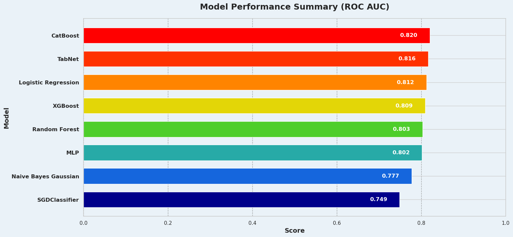

# D.R.I.P.: Diabetes Risk Identification and Prediction
Diabetes affects hundreds of millions worldwide. 22% of adults are undiagnosed and 58% of cases are potentially preventable. **D.R.I.P.**  utlizes machine learning and identifies 81% of individuals at risk for diabetes based on unseen data.


## Overview
D.R.I.P.'s [predictive web application](https://minerva-ds.github.io/diabetes-risk-identification-and-prediction/deployment/index.html) pre-screen's people for diabetes risk.  It can be quickly completed with only basic knowledge of your own health metrics such as height, weight, age and blood pressure.  The application runs locally via javascript on the individual's device, ensuring privacy by not storing or sending data.

D.R.I.P. aids healthcare providers in identifying individuals at risk for diabetes and educates users about their personal diabetes risk and its contributing factors.

## Data Source
D.R.I.P. is powered by a machine learning model trained on the [CDC's 2015 Behavioral Risk Factor Surveillance System](https://www.cdc.gov/brfss/annual_data/annual_2015.html), which was curated into a diabetes subset available from the [UCI Machine Learning Repository](https://archive.ics.uci.edu/dataset/891/cdc+diabetes+health+indicators). This dataset includes 23 health indicators from over 220,000 respondents, and the CDC has a strong history of providing comprehensive and reliable data. These qualities make an excellent foundation for a model that can give robust predictions.

## Modeling and Evaluation
### Baseline Models
Logistic regression provided a good baseline with an AUC of 0.8124. To explore how model choice would impact prediction, I tested a diverse set of more complex and well-regarded models. These included Random Forest for decision trees, XGBoost and CatBoost for boosting, and RBF, SGD, and TabNet for deep learning. The best-performing baseline models were then selected for hyperparameter tuning.



### Hypertuned Models
Two CatBoost models were trained.  One was on the class balanced data and one on the full training data with class weights.  Optuna was used to tune them, as well as a TabNet model.  Logistic was also tuned with GridSearchCV.


### Fintuned, Stacked and Averaged Models
Methods of combining different models was tested.  You can see the results here.  The finetuned CatBoost emerged as the MVP, trained first on the balanced data and then on the full training set.


### MVP Model
The finetuned CatBoost model is very effective, with a performance score (ROC AUC) of 0.8260. I chose a threshold to ensure the model is cautious, successfully identifying 81% of individuals at risk for diabetes, while maintaining an overall accuracy of 70%.


### Feature Impact
Using correlation, feature importance and a report on how the features impact the model, you can see your BMI, age, high blood pressure and cholesterol are highly predictive features.  These align with known diabetes risks.
#### Mean Feature Impact


#### Feature Importance from Random Forest


#### Feature and Target Correlation Heatmap


### Threshold Tuning
The threshold was adjusted to maximize recall while still giving a good overall model accuracy.  This lets it catch 81% of people at risk for diabetes while still being 70% accurate overall.


## Conclusion
D.R.I.P. predicts 81% of at-risk diabetes cases. It is accessible via a web application that runs on device, ensuring user privacy by not storing or sending any data.  

It meets the goal of helping healthcare providers pre-screen for diabetes risk and helping individuals know their personal diabetes risk and be educated on relevant risk factors.

## Main Project Files
[**Web Application**](https://minerva-ds.github.io/diabetes-risk-identification-and-prediction/deployment/) 
<br>Usable single page application that uses your self reported data to predict your diabetes risk.

[**Dashboard**](https://minerva-ds.github.io/diabetes-risk-identification-and-prediction/dashboard_files/combined_dashboard.html)
<br>Interactive charts from the project.

[**Final Notebook**](notebook.ipynb)
<br>The entire process used to make the tool and charts well documented in a Jupyer notebook with markdown.

[**Presentation**](presentation.pdf)
<br>The presentation slides.

## Advanced View
The default "simple" view of the web application limits the form to the most predictive features.  Selecting advanced view will reveal all base features used for training and calculate interaction terms behind the scenes.  The default action is to leave all "advanced" features as 0 or 1, whichever is the lowest number in the feature.

## Areas For Improvement
Certain health metrics, such as cholesterol checks, correlate with higher diabetes risk. This correlation might reflect underlying health issues prompting frequent screenings, rather than direct causation. Additionally, less predictive features might slightly skew risk assessments; for instance, poorer mental health could misleadingly appear to lower diabetes risk. This phenomenon may result from dominant features overshadowing weaker ones, unrecognized complex relationships, model limitations, data constraints, or infrequent occurrences of certain features. Removing these less predictive features during training actually lowered model accuracy. The existing model setup, refined through thorough testing and feature engineering, strives to finely tune diabetes risk predictions.  However, Data Science is nothing if not iterative and improvements are almost always possible.

## Further Development
Adding health indicators and exploring novel techniques with the current dataset could lead to further improvement. Other data sets can also be looked into and see if models with more predictive power can be made.  Data science is iterative, and continuous improvement is always possible.

## Repository Structure

| Directory/File                     | Description                                               |
|------------------------------------|-----------------------------------------------------------|
| **/data**                          | Data files used in analysis                               |
| ├── cdc_diabetes_data_features.pkl | Pickled file containing feature data                      |
| ├── cdc_diabetes_data_metadata.json| Metadata for the dataset                                  |
| ├── cdc_diabetes_data_targets.pkl  | Pickled file containing target data                       |
| ├── cdc_diabetes_data_variables.pkl| Information about dataset variables                       |
| **/docs**                          | Root directory for GitHub Pages content                   |
| ├── **/dashboard_files**           | Directory for dashboard-related HTML files                |
| │   ├── combined_dashboard.html    | Combined view of all analysis dashboards                  |
| │   ├── mean_impact.html           | Dashboard showing mean impact of variables                |
| │   ├── roc_auc.html               | ROC AUC curve for the models                              |
| │   └── threshold_analysis.html    | Analysis of various threshold settings                    |
| ├── **/deployment**                | Files related to model deployment                         |
| │   ├── catboost_model.js          | JavaScript file for model deployment                      |
| │   ├── index.html                 | Main HTML file for the deployment site                    |
| │   ├── **/models**                | Stored models in various formats                          |
| │   │   ├── catboost_model_fixed.onnx | ONNX model with fixed parameters                        |
| │   │   ├── catboost_model_no_zipmap.onnx | ONNX model without zipmap                             |
| │   │   ├── catboost_model.onnx    | Default CatBoost model in ONNX format                     |
| │   │   └── model.onnx             | General model file                                        |
| │   ├── **/scripts**               | Scripts used in deployment                                |
| │   │   └── dump_model.py          | Script for dumping model info for debugging
| │   ├── styles.css                 | CSS styles for the deployment frontend                    |
| │   └── **/test_onnx**             | HTML files for testing ONNX models                        |
| │       └── simple-example.html    | Simple HTML file for ONNX model testing                   |
| └── index.html                     | Main HTML file linking to project components              |
| **/environment_no_builds.yml**     | More system agnostic conda environment file                                    |
| **/environment_ubuntu.yml**        | Ubuntu-specific Conda environment file                    |
| **/images**                        | Directory for storing images used in README or notebooks  |
| ├── drip-header.png                | Header image for README or documentation                  |
| **/notebook.ipynb**                | Jupyter notebook with the project analysis                |
| **/README.md**                     | README file for project overview and navigation           |
| **/scrapbook**                     | Additional notebooks for exploratory analysis             |
| └── scrapbook.ipynb                | Notebook for storing miscellaneous analyses               |


## Reproducibility
### Prerequisites
Ensure you have these before continuing with the rest of the setup!

#### 1. **Clone the Repository**
It's assumed you have Git installed and are familiar with basic Git commands. If you haven't yet installed Git, you can download it from [git-scm.com](https://git-scm.com).

To clone the repository, open your command line tool:
- **macOS/Linux**: Open Terminal.
- **Windows**: Open Git Bash (recommended for Git operations).

Then execute the following commands:
```bash
git clone https://github.com/minerva-ds/diabetes-risk-identification-and-prediction
cd diabetes-risk-identification-and-prediction
```

#### 2. **Install Conda**
Ensure Conda is installed on your system. If not already installed, you can download it from [Miniconda](https://docs.conda.io/en/latest/miniconda.html) or [Anaconda](https://www.anaconda.com/products/individual).

### Quick Setup Options
After completing the prerequisites, choose one of the following quick setup options based on your operating system.

#### For Ubuntu Users
Quickly set up the environment using the `environment_ubuntu.yml` provided in the repository:
```bash
conda env create -f environment_ubuntu.yml
conda activate drip_env
```

#### For Non-Ubuntu Users
Use the `environment_no_builds.yml` for a smoother setup across different systems:
```bash
conda env create -f environment_no_builds.yml
conda activate drip_env
```
**Note:** The `--no-builds` option is used to enhance compatibility, but it's not guaranteed to work in all cases. If you encounter any issues, consider the manual setup instructions below.

### Manual Installation Steps
If the quick setup options do not meet your needs or you encounter issues, follow these detailed manual installation steps:

#### 1. **Create and Activate Environment**
Create and activate the Conda environment:
```bash
conda create -n drip_env python=3.10 pandas scipy scikit-learn seaborn matplotlib ipython sweetviz xgboost catboost pytorch-tabnet optuna onnx onnxruntime plotly -c conda-forge -y
conda activate drip_env
```

#### 2. **Install Additional Packages**
After activating the environment, proceed to install these additional packages:
```bash
conda install ipykernel -y
conda install skl2onnx -y
pip install ucimlrepo
```

#### 3. **Verify Installation**
Finally, to ensure all packages are installed correctly, run:
```bash
conda list
```

This setup process ensures your development environment is prepared correctly, letting you focus fully on your project.