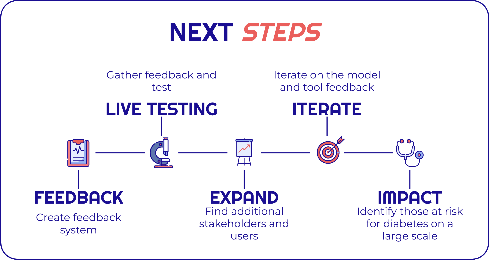

# Diabetes Risk Identification and Prediction (D.R.I.P.)
Diabetes impacts over 460 million people globally, with an estimated 22% of adults undiagnosed. Diabetes Risk Identification and Prediction (D.R.I.P.) is a [predictive web application](https://minerva-ds.github.io/diabetes-risk-identification-and-prediction/deployment/index.html)[^4] designed to help healthcare providers pre-screen for diabetes risk and educate individuals about their risk factors. Powered by a machine learning[^1] model trained on data from the CDC's Behavioral Risk Factor Surveillance System, the application achieves a ROC AUC[^2] score of 0.826, successfully identifying 81% of at-risk individuals.


## Project Context


Sources:
[NIH](https://www.ncbi.nlm.nih.gov/pmc/articles/PMC7310804/), 
[CDC](https://www.cdc.gov/diabetes/php/data-research/index.html),
[kidney.org](https://www.kidney.org/kidney-topics/diabetes-major-risk-factor-kidney-disease),
[diabetes.org](https://diabetes.org/newsroom/press-releases/new-american-diabetes-association-report-finds-annual-costs-diabetes-be),
[WHO](https://www.who.int/news-room/fact-sheets/detail/diabetes),
[Harvard Health](https://www.health.harvard.edu/blog/healthy-lifestyle-can-prevent-diabetes-and-even-reverse-it-2018090514698)

This global prevalence of diabetes reflects an urgent need for effective preventive measures and early detection tools, which is where this project can help.

## Web Application
The project's deployment is a [predictive web application](https://minerva-ds.github.io/diabetes-risk-identification-and-prediction/deployment/index.html)[^4] that can be quickly completed with only basic knowledge of your own health metrics such as height, weight, age and blood pressure.  The application runs via JavaScript using ONNX Runtime Web[^3] on the individual's device, ensuring privacy by not storing or sending data. It works on both desktop and mobile devices.

### Advanced View
The default "simple" view of the web application limits the form to the most predictive features.  This is the recommended way to use the application.  If you click the checkbox for advanced view, features that are defaulted to off will be revealed to you and you can fill them out.  Advanced view is mostly for transparency and testing. 

## Data Source
Diabetes Risk Identification and Prediction (D.R.I.P.) is powered by a machine learning model trained on the [CDC's 2015 Behavioral Risk Factor Surveillance System](https://www.cdc.gov/brfss/annual_data/annual_2015.html), which was curated into a diabetes subset available from the [UCI Machine Learning Repository](https://archive.ics.uci.edu/dataset/891/cdc+diabetes+health+indicators). This dataset includes 23 health indicators from over 220,000 respondents, and the CDC has a strong history of providing comprehensive and reliable data. These qualities make an excellent foundation for a model that can give robust predictions.

## Modeling and Evaluation
### Baseline Models
Logistic regression provided a good baseline with an AUC of 0.8124. To explore how model choice would impact prediction, I tested a diverse set of more complex and well-regarded models. These included Random Forest for decision trees, XGBoost and CatBoost for boosting, and MLP, SGD, and TabNet for deep learning. The best-performing baseline models were then selected for hyperparameter tuning.


### Hypertuned Models
Two CatBoost models were trained.  One was on the class balanced data and one on the full training data with class weights.  Optuna was used to tune them, as well as a TabNet model.  Logistic was also tuned with GridSearchCV.


### Finetuned, Stacked and Averaged Models
Methods of stacking, averaging and finetuning models were tested.  The finetuned CatBoost emerged as the strongest model and is the Minimum Viable Product (MVP).  It was trained first on the balanced data and then on the full training set.


### MVP Model
The finetuned CatBoost model is very effective, with a performance score (ROC AUC) of 0.8260. I chose a .32 threshold to ensure the model is cautious, successfully identifying 81% of individuals at risk for diabetes, while maintaining an overall accuracy of 70%.


### Feature Impact
Using a correlation map of the features to the target, feature importance and a report on how the features impact the model, you can see your BMI, age, high blood pressure and cholesterol are highly predictive features.  These align with known diabetes risks.
#### Mean Feature Impact


#### Feature Importance from Random Forest


#### Feature and Target Correlation Heatmap


### Threshold Tuning
The threshold was adjusted to maximize finding those at risk while still giving a good overall model accuracy. This allows it to identify 81% of individuals at risk for diabetes while maintaining an overall accuracy of 70%.


### Improvement Over Baseline
Compared to the first Logistic Regression model the Finetuned CatBoost model improved its ROC AUC score from .812 to .826.  However, before extensive cleaning, data preparation, and feature engineering, the initial models achieved an ROC AUC below 0.8.  This shows just how important these steps are in creating a better performing model.

## Main Project Files
[**Web Application**](https://minerva-ds.github.io/diabetes-risk-identification-and-prediction/deployment/) 
<br>A single-page application that uses your self reported data to predict your diabetes risk.

[**Dashboard**](https://minerva-ds.github.io/diabetes-risk-identification-and-prediction/dashboard_files/combined_dashboard.html)
<br>Interactive charts from the project.

[**Final Notebook**](notebook.ipynb)
<br>The entire process used to make the tool and charts well documented in a Jupyter notebook with markdown.

[**Presentation**](presentation.pdf)
<br>The presentation slides.

## Areas For Improvement
### Number of False Positives
This metric reflects the number of individuals wrongly identified as at risk for diabetes by the model. While the model achieves a 70% overall accuracy and correctly identifies 81% of genuine at-risk cases, it also mislabels people as at risk when they are not. In medical diagnostics, it is often preferable to err on the side of caution by identifying more potential at-risk individuals, rather than missing those who may require intervention. This approach ensures fewer at-risk individuals are overlooked, even though it may lead to increased costs and unnecessary stress for those not at risk.

Extensive efforts were taken to optimize the model, which after a review boasts the highest ROC AUC score compared to other projects using the same dataset that I could find, the limitations inherent to the dataset itself might constrain further improvements in reducing false positives. Improving the model further and making it more predictive though is a continuous goal.

Below is the confusion matrix for the final model.


The table below shows the classification report for the final model.  Note especially the recall for Class 1 and accuracy cited in this README.

|            | Precision | Recall | F1-score | Support |
|------------|-----------|--------|----------|---------|
| **Class 0** | 0.95      | 0.68   | 0.79     | 38,746  |
| **Class 1** | 0.31      | 0.81   | 0.45     | 6,836   |
| **Accuracy**  |           |        | 0.70     | 45,582  |
| **Macro Avg** | 0.63      | 0.74   | 0.62     | 45,582  |
| **Weighted Avg** | 0.86  | 0.70   | 0.74     | 45,582  |


### Some Feature Interactions
An intriguing interaction involves checking the feature "Have you had your cholesterol checked within the last 5 years?" While the model suggests this increases diabetes risk, it likely indicates that individuals getting these checks might have pre-existing health concerns that necessitate such tests. However, staying on top of your health with checks is in itself a good thing. 

The model displays non-intuitive outcomes for various less predictive features. For instance, configurations indicating poorer mental health sometimes appear to slightly reduce the predicted risk of diabetes. However, removing these less predictive features has been shown to degrade model performance. These unexpected results could stem from several factors: rare co-occurrences of specific feature combinations, not fully understood interactions between features, dominant features overshadowing weaker ones, or inherent dataset limitations. As with all data science endeavors, the project is subject to continuous refinement to improve accuracy and reliability.

## Further Development
Adding health indicators and exploring novel techniques with the current dataset could lead to further improvement. Other data sets can also be looked into and see if models with more predictive power can be made.  Data science is iterative, and continuous improvement is always possible.

## Next Steps
The next steps for this project are covered in summary below.



## Conclusion
Diabetes Risk Identification and Prediction(D.R.I.P.) predicts 81% of at-risk diabetes cases and has identified and predicts on many well known risks of diabetes. It is accessible via a web application that runs locally on the user's device, ensuring user privacy by not storing or sending any data.  

It meets the goal of helping healthcare providers pre-screen for diabetes risk and helping individuals know their personal diabetes risk and be educated on relevant risk factors.

## Repository Structure

| Directory/File                     | Description                                               |
|------------------------------------|-----------------------------------------------------------|
| **/data**                          | Data files used in analysis                               |
| ├── cdc_diabetes_data_features.pkl | Pickled file containing feature data                      |
| ├── cdc_diabetes_data_metadata.json| Metadata for the dataset                                  |
| ├── cdc_diabetes_data_targets.pkl  | Pickled file containing target data                       |
| ├── cdc_diabetes_data_variables.pkl| Information about dataset variables                       |
| **/docs**                          | Root directory for GitHub Pages content                   |
| ├── **/dashboard_files**           | Directory for dashboard-related HTML files                |
| │   ├── combined_dashboard.html    | Combined view of all analysis dashboards                  |
| │   ├── mean_impact.html           | Dashboard showing mean impact of variables                |
| │   ├── roc_auc.html               | ROC AUC curve for the models                              |
| │   └── threshold_analysis.html    | Analysis of various threshold settings                    |
| ├── **/deployment**                | Files related to model deployment                         |
| │   ├── catboost_model.js          | JavaScript file for model deployment                      |
| │   ├── index.html                 | Main HTML file for the deployment site                    |
| │   ├── **/models**                | Stored models in various formats                          |
| │   │   ├── catboost_model_fixed.onnx | ONNX model with fixed parameters                        |
| │   │   ├── catboost_model_no_zipmap.onnx | ONNX model without zipmap                             |
| │   │   ├── catboost_model.onnx    | Default CatBoost model in ONNX format                     |
| │   │   └── model.onnx             | General model file                                        |
| │   ├── **/scripts**               | Scripts used in deployment                                |
| │   │   └── dump_model.py          | Script for dumping model info for debugging
| │   ├── styles.css                 | CSS styles for the deployment frontend                    |
| │   └── **/test_onnx**             | HTML files for testing ONNX models                        |
| │       └── simple-example.html    | Simple HTML file for ONNX model testing                   |
| └── index.html                     | Main HTML file linking to project components              |
| **/environment_no_builds.yml**     | More system agnostic conda environment file                                    |
| **/environment_ubuntu.yml**        | Ubuntu-specific Conda environment file                    |
| **/images**                        | Directory for storing images used in README or notebooks  |
| **notebook.ipynb**                | Jupyter notebook with the project analysis                |
| **README.md**                     | README file for project overview and navigation           |
| **/scrapbook**                     | Additional notebooks for exploratory analysis             |
| └── scrapbook.ipynb                | Notebook for storing miscellaneous analyses               |


## Reproducibility
This section is technical and not meant for a general audience. 

### Prerequisites
Ensure you have these before continuing with the rest of the setup!

#### 1. **Clone the Repository**
It's assumed you have Git installed and are familiar with basic Git commands. If you haven't yet installed Git, you can download it from [git-scm.com](https://git-scm.com).

To clone the repository, open your command line tool:
- **macOS/Linux**: Open Terminal.
- **Windows**: Open Git Bash (recommended for Git operations).

Then execute the following commands:
```bash
git clone https://github.com/minerva-ds/diabetes-risk-identification-and-prediction
cd diabetes-risk-identification-and-prediction
```

#### 2. **Install Conda**
Ensure Conda is installed on your system. If not already installed, you can download it from [Miniconda](https://docs.conda.io/en/latest/miniconda.html) or [Anaconda](https://www.anaconda.com/products/individual).

#### 3. **Nvidia GPU**
I used CUDA to train many models so it is recommended you do the same or be able to alter the code to run with CPU.

### Quick Setup Options
After completing the prerequisites, choose one of the following quick setup options based on your operating system.

#### For Ubuntu Users
Quickly set up the environment using the `environment_ubuntu.yml` provided in the repository:
```bash
conda env create -f environment_ubuntu.yml
conda activate drip_env
```

#### For Non-Ubuntu Users
Use the `environment_no_builds.yml` for a smoother setup across different systems:
```bash
conda env create -f environment_no_builds.yml
conda activate drip_env
```
**Note:** The `--no-builds` option is used to enhance compatibility, but it's not guaranteed to work in all cases. If you encounter any issues, consider the manual setup instructions below.

### Manual Installation Steps
If the quick setup options do not meet your needs or you encounter issues, follow these detailed manual installation steps:

#### 1. **Create and Activate Environment**
Create and activate the Conda environment:
```bash
conda create -n drip_env python=3.10 pandas scipy scikit-learn seaborn matplotlib ipython sweetviz xgboost catboost pytorch-tabnet optuna onnx onnxruntime plotly -c conda-forge -y
conda activate drip_env
```

#### 2. **Install Additional Packages**
After activating the environment, proceed to install these additional packages:
```bash
conda install ipykernel -y
conda install skl2onnx -y
pip install ucimlrepo
```

#### 3. **Verify Installation**
Finally, to ensure all packages are installed correctly, run:
```bash
conda list
```

This setup process ensures your development environment is prepared correctly, letting you focus fully on your project.

## Footnotes
[^1]: **Machine Learning**: A branch of artificial intelligence that involves teaching computers to learn from data, without being explicitly programmed.
[^2]: **ROC AUC (Receiver Operating Characteristic Area Under the Curve)**: A performance measurement for classification problems at various threshold settings. ROC is a probability curve, and AUC represents the degree or measure of separability.
[^3]: **ONNX Runtime Web**: An open-source runtime that allows running ONNX (Open Neural Network Exchange) models on web browsers.
[^4]: **Predictive Web Application**: A predictive web application is a web-based tool that uses machine learning or statistical models to forecast future events based on historical data.

# Author
Chisum Lindauer

# Credits
* Slide theme taken from [Slidesgo](https://slidesgo.com/theme/type-2-diabetes-breakthrough#search-Diabetes&position-7&results-29) with additional icons recolored by me to fit the theme.
* Header image modified from a royalty free image from [Vectorstock](https://www.vectorstock.com/royalty-free-vector/diabetes-mellitus-concept-banner-header-vector-22864871)

# Thank You
* [Flatiron School](https://flatironschool.com/) for their great program, teaching staff and cohort.
* Family and friends for all the support and love they gave me.
* My cat Biscuit for being a constant coding companion.
* **You**, for taking the time to read this!